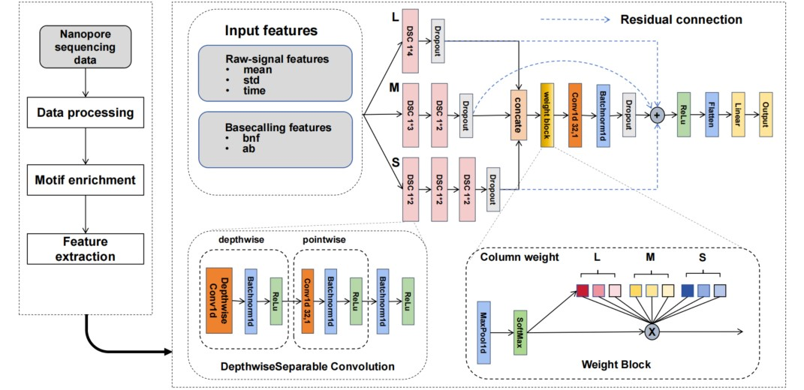

# MotifNet
A multi-column convolutional neural network model for typing and fine mapping of various bacterial methylation motifs using Nanopore Sequencing.

## Workflow


## Model Architecture


# Contents

- [MotifNet](#motifnet)
- [Contents](#contents)
- [Prerequisites](#prerequisites)
- [Data Preprocess](#data-preprocess)
- [MotifNet train and test](#motifnet-train-and-test)
  - [Get train and valid data](#get-train-and-valid-data)
  - [Get test data](#get-test-data)
  - [Change data form](#change-data-form)
  - [Train and test MotifNet model](#train-and-test-motifNet-model)
  - [Do loocv evaluation](#do-loocv-evaluation)
- [Data availability](#data-availability)
  - [Train Data](#train-data)
  - [Test Data](#test-data)
  - [Reference](#reference)
- [Pretrained model](#pretrained-model)


# Prerequisites

There are two environments to build, an R environment for data preprocessing and motif enrichment, and a python environment for MotifNet model training.

**R:**

follow the nanodisco (https://github.com/fanglab/nanodisco/tree/master) to build the virtual environment using Singularity (v3.2.1 and above).

**python:**

Use MotifNet/env/freeze.yml to generate the environment directly under conda.

```bash
conda env create -f freeze.yml
```
# Data Preprocess
In this part we need to use the modified nanodisco to preprocess the data.We should install nanodisco and bam-readcount first.

Run the update.sh to update origin data preprocess function of nanodisco. The original nanodisco could only handle mean features, and we modified it to handle four additional features (std, time,the proportion of reference bases, average quality score). We also added base feature to facilitate positional correction.
```bash
chmod +x ./process/code/update.sh
#-p is followed by the path of the nanodisco container that was built
bash ./process/code/update.sh -p /home/chenzh/Project1_1/nd_example2
```

First, we need to pre-process the necessary files from the original nanopore signal:
```bash
#Pass in the parameters in the following order
#DATASET_WGA_PATH=$1
#DATASET_NAT_PATH=$2
#SAMPLE_WGA_NAME=$3
#SAMPLE_NAT_NAME=$4
#REF_PATH=$5
#PRE_OUTPUT_DIR=$6 (Preprocess)
#DIFF_OUTPUT_DIR=$7 (The WGA and NAT files need to be subtracted)
#MERGE_OUTPUT_DIR=$8 (Because of memory constraints, we need to preprocess in chunks first, and then we need to merge)
#MERGE_NAME=$9
chmod +x ./process/code/MotifNet_preprocess.sh
bash ./process/code/MotifNet_preprocess.sh dataset/unzip_data/MinION_NO_WGA dataset/unzip_data/MinION_NO_NAT NO_WGA NO_NAT reference/NO/NO_sequence.fasta analysis/NO/preprocessed_subset analysis/NO/difference_subset analysis NO
```

To do motif enrichment:

```bash
#Pass in the parameters in the following order
#Bactrial_name=$1
#DIFF_PATH=$2
#MOTIF_ENRICH_OUTPUT_PATH=$3
#REF_PATH=$4
chmod +x ./process/code/MotifNet_enrich.sh
bash ./process/code/MotifNet_enrich.sh NO analysis/NO_subset_difference.RDS analysis/NO reference/NO/NO_sequence.fasta
```


To get basecall feature:

```bash
#Pass in the parameters in the following order
#REF_PATH=$1
#DATA_PATH=$2
#OUTPUT_PATH=$3
chmod +x ./process/code/MotifNet_readcount.sh
bash ./process/code/MotifNet_readcount.sh /home/chenzh/Project1_1/nd_example2/home/nanodisco/reference/NO/NO_sequence.fasta /home/chenzh/Project1_1/nd_example2/home/nanodisco/analysis/NO/preprocessed_subset/NO_NAT.fasta /home/chenzh/readcount/NO_NAT_fq.tsv

```

# MotifNet train and test

## Get train and valid data
```bash
Rscript ./code/MotifNet_traindata.R
```
You may need to change my results path in the function.

## Get test data

```bash
#Pass in the parameters in the following order
#Bactrial_PATH=${1:-"NO"}
#DIFF_PATH=${2:-"analysis/NO_subset_difference.RDS"}
#OUTPUT_PATH=${3:-"analysis/NO/NO_motifs_my_train"}
#Motif=${4:-"analysis/NO/NO_motifs_my_train"}
#REF_PATH=${5:-"reference/NO/NO_sequence.fasta"}
chmod +x ./code/MotifNet_testdata.sh
bash ./code/MotifNet_testdata.sh
```

## Change data form

Since the data we are working with is in an R environment, we need to convert it to a pkl file that can be used in a python environment using data_from_R_to_python.ipynb.

## Train and test MotifNet model

```bash
python ./model/train_test.py
```
This file also contains a section for test results.

## Do loocv evaluation

```bash
python ./model/train_loocv_model.py
python ./model/train_loocv_test.py
```
# Data availability

## Train Data

All data used in this work are available at the Sequence Read Archive under the BioProjects PRJNA559199. Seven species of bacteria were used for training: 

Bacillus amyloliquefaciens H

Bacillus fusiformis 1226

Clostridium perfringens ATCC 13124

Escherichia coli K-12 substr. MG1655 ATCC 47076

Helicobacter pylori JP26

Methanospirillum hungatei JF-1

Neisseria gonorrhoeae FA 1090

Nocardia otitidiscaviarum NEB252 

Thermacetogenium phaeum DSM 12270.

There are 46 different motifs in these seven bacteria, including 7 4mC motifs, 11 5mC motifs, and 28 6mA motifs.

## Test Data

An independent dataset containing nanopore reads of two bacteria was used for testing.:

Nocardia otitidiscaviarum NEB252

Thermacetogenium phaeum DSM 12270

There are 12 different motifs in these two species, including 6 4mC motifs, 1 5mC motif, and 5 6mA motifs. 

## Reference

The reference sequences of the bacteria samples are available at NCBI with the accession codes: CP041693, CP041696, NC_008261.1, CP014225.1, CP023448.1, NC_007796.1, NC_002946.2, CP041695 and CP003732. Methylation motifs of those bacteria were collected from the REBASE database.

# Pretrained model

you can just use the model we provide in best_model/MotifNet.pt, you can run postprocess.py achieve the best results with  module.